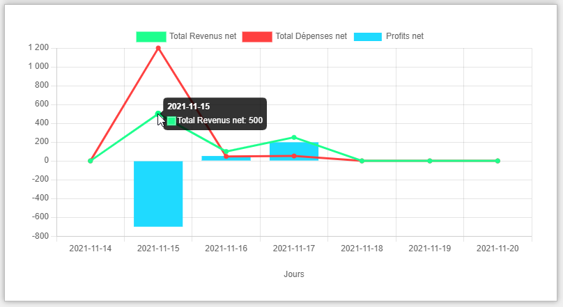

Depuis le 17 novembre 2021, le logiciel Finance&nbsp;D génère un **graphique tendanciel** pour vos revenus, 
dépenses et profits nets dans la fenêtre de l'État des résultats.

Avec cette nouveauté, vos chiffres d'affaires sont encore plus révélateurs qu'avant.

**La manière dont fonctionne ce graphique est simple :** Lorsque vous sélectionnez une période 
(une date de début et une date de fin) pour laquelle vous souhaitez voir les résultats, 
le graphique va dynamiquement s'adapter à la quantité de jours
qui sont inclus dans cette période afin de vous présenter des tendances faciles à comprendre.

**L'avantage d'un tel graphique est de voir le progrès de vos profits dans le temps**. Or, cela peut vous aider à mieux
comprendre quelles sont vos moins bonnes et meilleures saisons d'affaires.

Pour voir ce graphique, vous n'avez rien à faire de plus. Il suffit d'ouvrir la fenêtre de l'État des résultats dans
votre dossier de tenue de livre Finance&nbsp;D.
